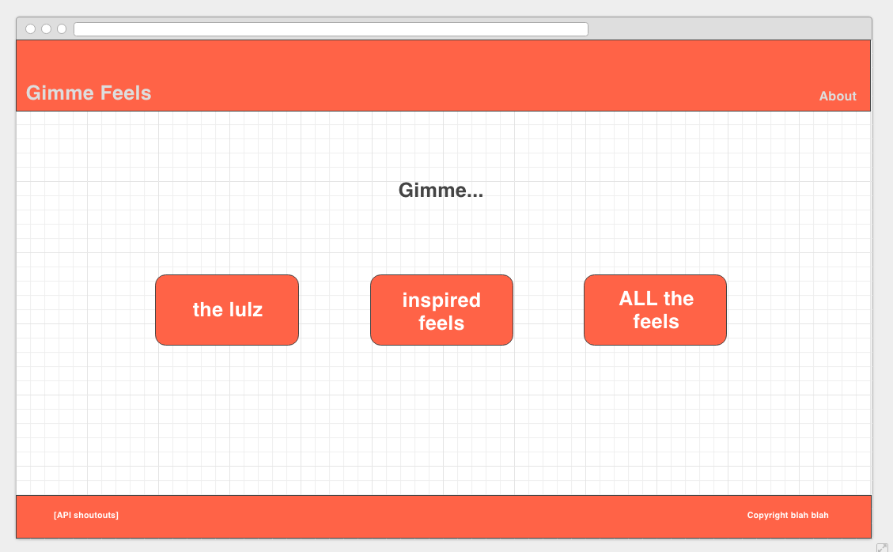
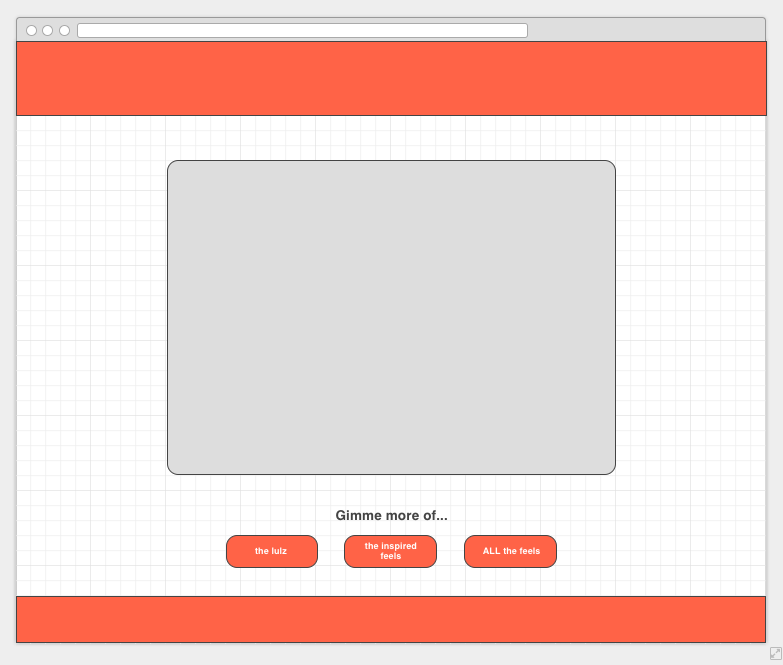

### Q1 Project: Gimme Feels  
Gimme feels is a web app that let's you decide how you want to feel and then nurtures that feeling. Maybe you're just feeling blah, or you're feeling down and need a pick-me-up. Gimme Feels' simple three-button interface let's you choose laughter, inspiration, or all the feels. Choosing "the lulz" will display a random Chuck Norris joke., choosing "inspired feels" will display an inspirational quote from formismatic, and choosing "all the feels" will display a randomly selected poem from PoetryDB. Let the feels consume you!

#### Wireframes  
  

#### APIs Used  
* [Forismatic API](http://forismatic.com/en/api/)
* [The Internet Chuck Norris Database API](http://www.icndb.com/api/)
* [PoetryDB](http://poetrydb.org/index.html)  
All three APIs return in JSON format with a mixture of objects and arrays when parsed.

#### Technologies Used
* jQuery  
* JavaScript  
* AJAX
* HTML
* CSS

#### Pivotal Tracker Link  
https://www.pivotaltracker.com/n/projects/1909521

#### Production Site
http://gimme-feels.surge.sh

#### Retrospective
https://docs.google.com/spreadsheets/d/1G1WqbsGrEZx_A3JN58OwqRg4j6CGzYy77FBsVgdCBPA/edit?usp=sharing

#### Self-Assessment
https://docs.google.com/document/d/1bDjCbUNUiU9Pgrwt9MzIPKLe6cIMruluC48XbtIqBgk/edit?usp=sharing
